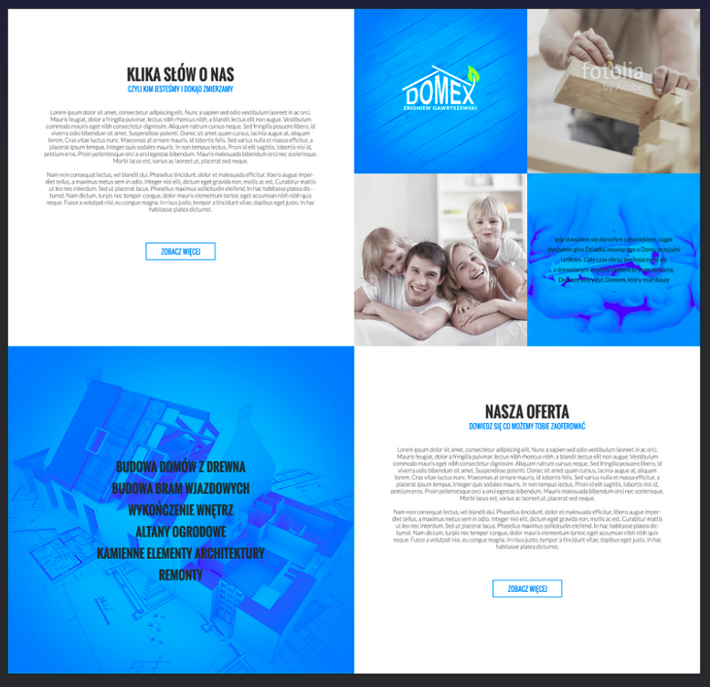

# Task description
## General
Styling part - creating a view according to the graphic (1 subpage) Imgur graphic. The transition from the first part to the second should be done using the button See more in the graphic

Logical part - connection to API, no styling, simple components

## Task 1.
Create a view according to graphics (1. page/view) Graphics Imgur. The transition from the 1. subpage/part to the second should be done using the button 
See more in the graphic

## Task 2a.
list of houses (2. page/view)

## Task 2b.
single house details (3. page/view)

## Task 2c.
delete house from houses-list and from the single-house-details (so delete from 2. or 3. page/view)

## Task 2d.
add house (4. subpage)

 

# API
## Swagger
http://mobile-reality-backend.sadek.usermd.net/swagger/#/

## Endpoints URL
 - get all houses (get): http://mobile-reality-backend.sadek.usermd.net/houses/all
 - get single house (get): http://mobile-reality-backend.sadek.usermd.net/houses/{id}
 - create (post): http://mobile-reality-backend.sadek.usermd.net/houses
 - delete single house (delete): http://mobile-reality-backend.sadek.usermd.net/houses/{id}

 

# Fronts
## Start page
https://imgur.com/a/OqZk8QV

